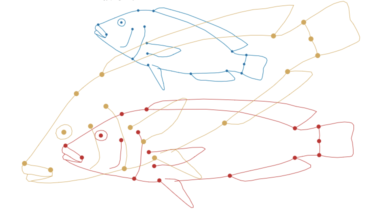
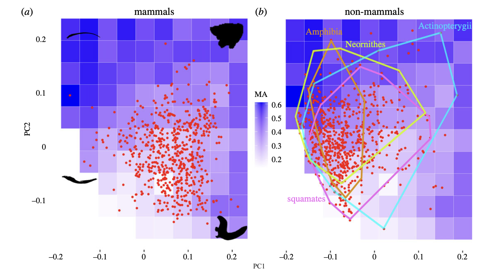
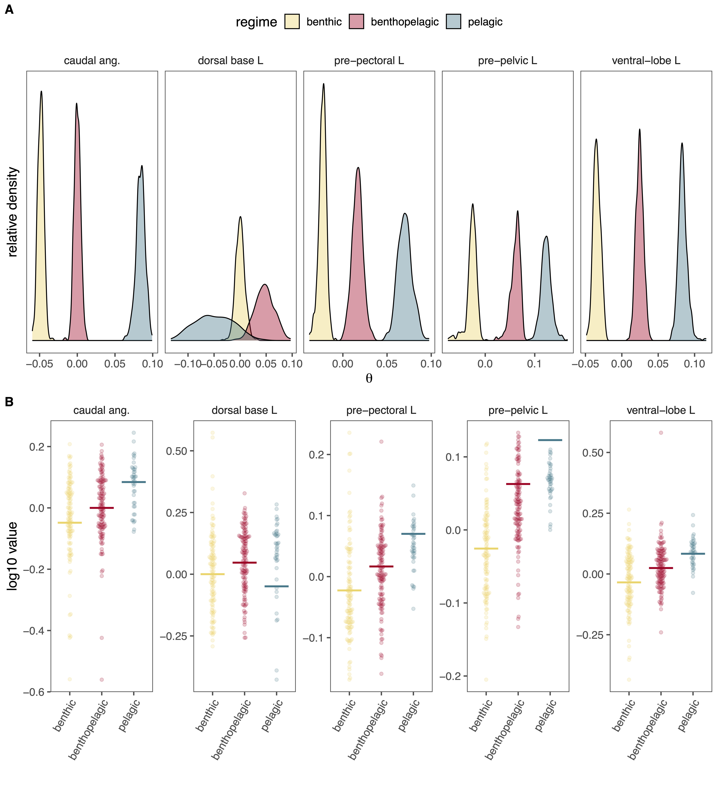
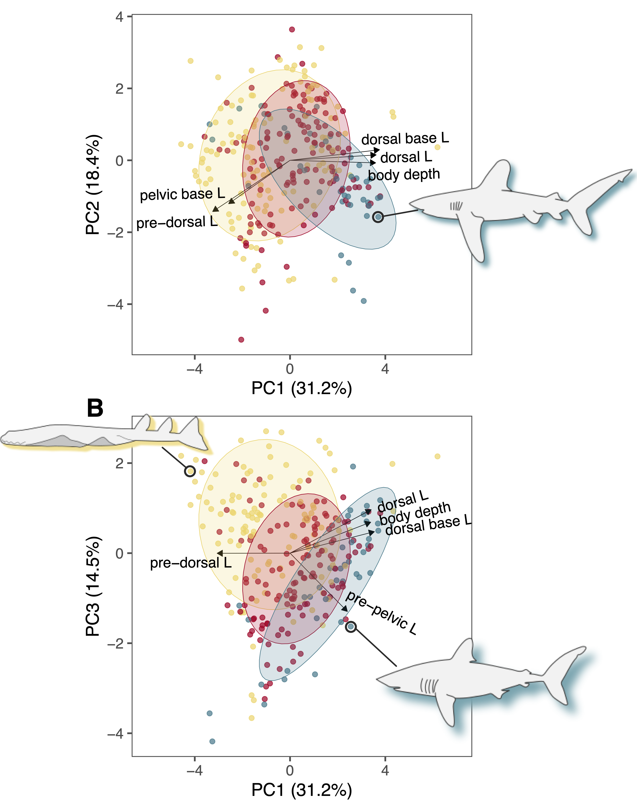
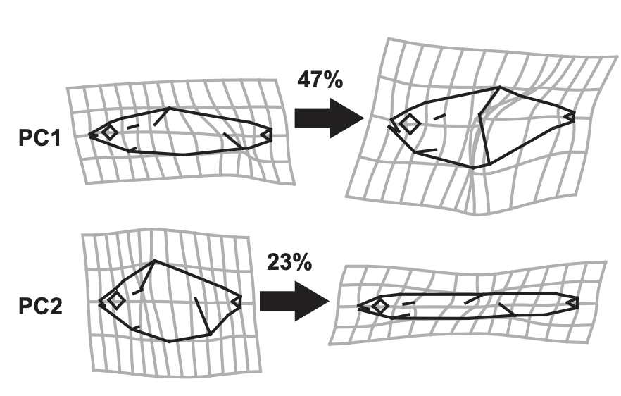
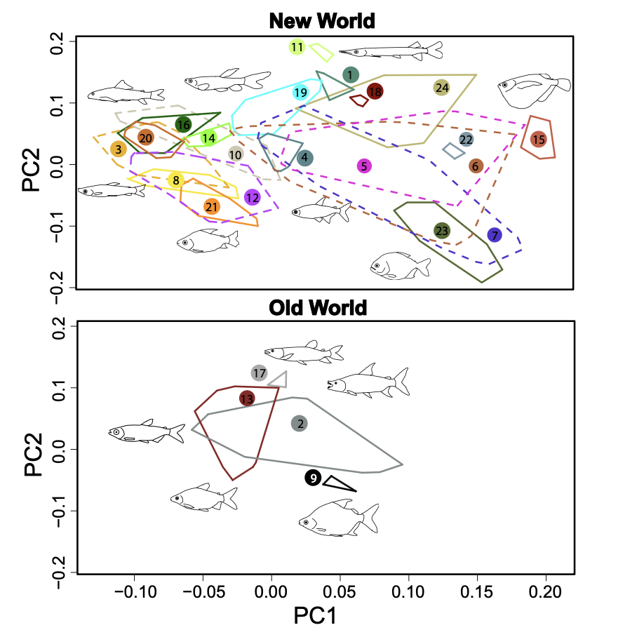
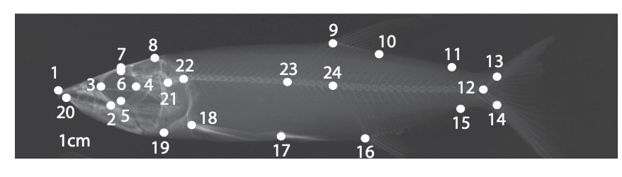

```{r setup, include=FALSE}
knitr::opts_chunk$set(
  echo = FALSE,
  warning = FALSE,
  message = FALSE
)
```


## Today’s goals

Today we'll:

- Explain the difference between **shape** and **size**
- Recognize different **types of shape data**
- Explore why **reproducible workflows** matter
- See how data, code, and interpretation fit together
- set up an R project and Git
- Release and look at [AME1](https://bcshape.github.io/class/AMEs/AME1.html)

---

## Shape vs. size: not the same thing

.pull-left[
**Size**
- How big something is
- Often summarized with one number
- Examples:
  - mass
  - length
  - area
]

.pull-right[
**Shape**
- How parts are arranged relative to one another
- Inherently **multidimensional**
- Depends on geometry, not magnitude


]


---

## Why biologists care about shape

Shape often links directly to:

- function (feeding, locomotion, defense)
- performance (speed, force, efficiency)
- ecological role
- evolutionary history

> Two organisms can be the same size  
> and behave *very* differently because of shape.


---

## A working definition of shape

.pull-left[
**Shape is the geometry of an object after removing:**
- size
- position
- orientation
]


.pull-right[
**What remains is relative structure**

This is why shape:
- requires multiple variables
- is hard to summarize with a single number
- benefits from multivariate thinking


]
---

## Shape almost always implies comparison

.pull-left[
You rarely study shape in isolation.

Instead, you ask:
- How do shapes differ among groups?
- How does shape change across environments?
- How does shape evolve over time?
]

.pull-right[

**Shape is meaningful because it varies**


]

---

## Data types in shape analysis

Not all “shape data” look the same.

Today we’ll distinguish among:
1. Univariate measurements  
2. Multivariate linear measurements  
3. Landmark and outline data  
4. Function and performance data  

Each answers *different kinds of questions*.

---

## Univariate data

.pull-left[
- One variable at a time
- Easy to analyze
- Easy to misinterpret
]

.pull-right[
**Examples**
- bone length
- jaw height
- fin area


]


**Limitation:**  
Univariate data cannot capture geometry or covariance.

---

## Multivariate linear measurements

.pull-left[
- Multiple linear variables per specimen
- Can describe proportions and relationships
- Often analyzed with PCA or regression


]

.pull-right[
**Examples**
- fin base length and height, skull length and width
- multiple distances on a body


]

These begin to capture **shape**, but indirectly.

---

## Why covariance matters

.pull-left[


Shape lives in **relationships among variables**.

Example:
- long + narrow vs.
- short + wide

Two specimens may have:
- identical areas
- very different shapes



]

.pull-right[
Multivariate data allow us to see these patterns.


]
---

## Landmark data

.pull-left[
- Points placed at homologous locations
- Preserve geometry explicitly
- Common in morphometrics
]

.pull-right[
**Examples**
- joint locations
- tooth cusps
- fin insertion points
]

Landmarks allow direct analysis of shape geometry.


---

## Outline data

.pull-left[
- Shape described by boundaries
- No discrete landmarks required
- Captures overall form
]

.pull-right[
**Examples**
- leaf outlines
- fin margins
- shells
]

Often analyzed using Fourier or eigenshape methods.


---

## Function and performance data

Not shape *per se*, but tightly linked.

Examples:
- bite force
- swimming speed
- acceleration
- metabolic cost

These help connect **shape → performance → fitness**.


---

## Choosing the right data type

Ask first:
- What biological question am I asking?
- Do I care about geometry?
- Do I care about performance?
- What assumptions am I willing to make?

No single data type is "best" — only *appropriate*.

---

## From data to inference

Collecting shape data is only the beginning.

.pull-left[
You also need:
- analysis
- interpretation
- transparency
- reproducibility

This is where workflow matters.
]

.pull-right[

]
---

## What is a reproducible workflow?

.pull-left[
A workflow where:
- someone else can run your analysis
- results regenerate automatically
- decisions are documented

Key ingredients:
- R projects
- R Markdown
- version control (Git/GitHub)
]

.pull-right[


]
---

## R Projects

.pull-left[
An **R Project**:
- defines a working directory
- keeps paths relative
- keeps everything together

Why this matters:
- no broken file paths
- easier collaboration
- fewer “works on my machine” problems
]

.pull-right[


]
---

## R Markdown

.pull-left[
R Markdown lets you combine:
- code
- results
- text
- figures

In one document.

This means:
- figures update automatically
- interpretation stays linked to analysis
- fewer copy–paste errors
]

.pull-right[


]
---

## Code + interpretation = science

.pull-left[
A figure without explanation is incomplete.  

Text without code is unverifiable.

R Markdown forces you to:
- show how results were produced
- explain what they mean
- keep them connected
]

.pull-right[


]
---

## Git and GitHub

.pull-left[
**Git** tracks changes over time.  
**GitHub** stores and shares those changes.

Together, they let you:
- recover earlier versions
- document progress
- collaborate safely
- show how work evolved
]

.pull-right[


]
---

## Why this matters for shape analysis

.pull-left[
Shape analyses are:
- multivariate
- assumption-heavy
- easy to over-interpret

Reproducible workflows:
- make errors visible
- support reanalysis
- improve scientific credibility
]

.pull-right[


]

