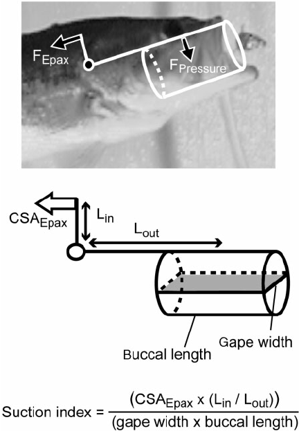
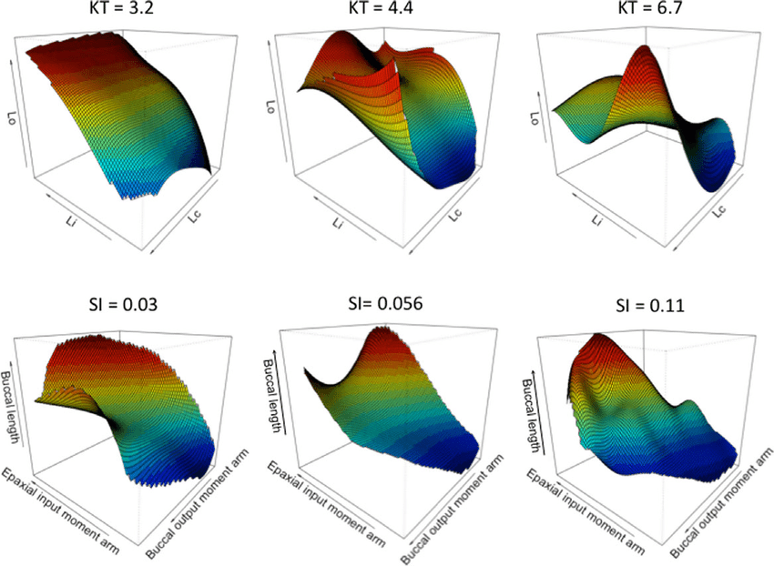
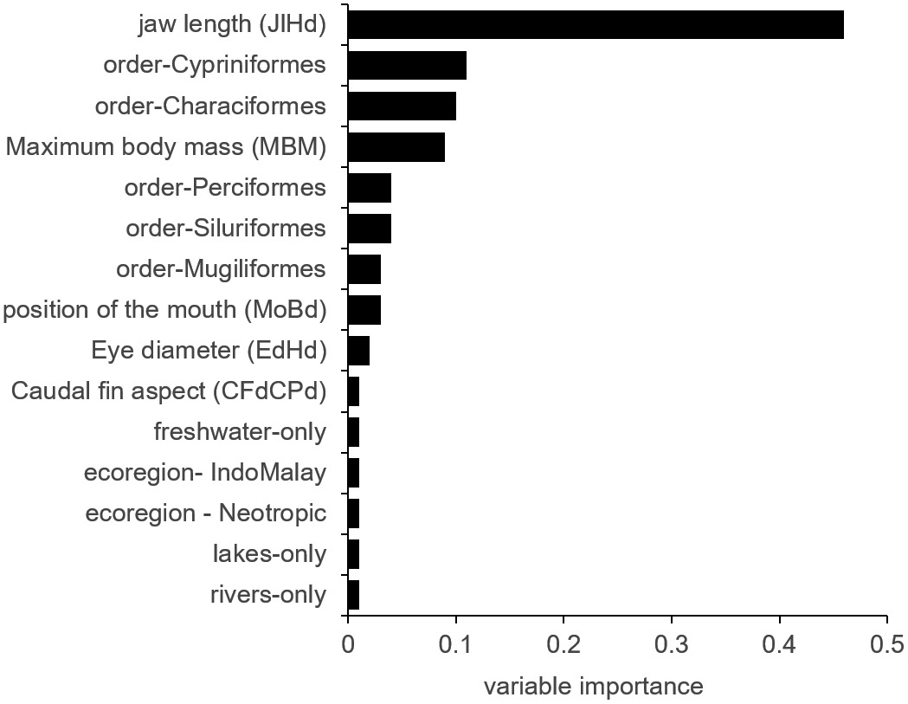

```{r setup, include=FALSE}
knitr::opts_chunk$set(
  echo = TRUE,
  message = FALSE,
  warning = FALSE
)

library(tidyverse)
```

```{css, echo=FALSE}
.remark-slide-content { font-size: 18px; }
.remark-code, .remark-inline-code { font-size: 14px; }
.small { font-size: 16px; }
.tiny  { font-size: 12px; }
.emph  { font-weight: 700; }
.note  { color: #555; font-size: 20px; }
```

---

# Shape, size, and their problems

### Today: 

- Many-to-one mapping 
- Consider scaling/allometry 
- Consider a no-no: ratios 
- Address allometry
- Chat/Questions


---

# 1. Many-to-one mapping

- Multiple morphologies → same performance
- Selection acts on **function**, not shape
- Morphospace ≠ performance space


---

# Consequence
.pull-left[
Hard to link morphospace to fitness:
- 2 $<$ parameters describing shape = multiple solitions
- Morphospace may have more than one performance peak
- Functional/performance redundancy ≠ lack of information



]

.pull-right[


]

---
# 2. Scaling and shape

.pull-left[
- Size changes geometry automatically
- Bigger organisms are *differently shaped*
- Ignoring size assumes **isometry**

Isometry is a fraught biological assumption.
]

.pull-right[

**Isometry**: change is constant constant
**Allometry**: rate of changes changes with size


]

---

# A scaling example

.pull-left[
```{r,echo=F}
set.seed(1)
n <- 200
size <- runif(n, 100, 1000)

trait_A <- 2 * size^1.2 + rnorm(n, 0, 50)
trait_B <- 5 * size^0.8 + rnorm(n, 0, 30)

dat <- tibble(size, trait_A, trait_B)

ggplot(dat, aes(size, trait_A)) +
  geom_point(alpha = 0.6) +
  labs(title = "Allometric scaling of Trait A (linear axes)")+
  theme_classic(20)
```
]

.pull-right[

```{r,echo=F}
ggplot(dat, aes(size, trait_A)) +
  geom_point(alpha = 0.6) +
  scale_x_log10() +
  scale_y_log10() +
  labs(title = "Allometric scaling of Trait A (log axes)")+
  theme_classic(20)
```
]

---

# 3. Ratios: why people use them

.pull-left[

Ratios:
- Simple
- Dimensionless
- Feel like size correction

But simplicity hides assumptions.
]

.pull-right[

]

---

# The ratio trap

.pull-left[
Ratios:
- Assume isometry
- Hide size in the denominator
- Can create spurious correlations

**Ratios do not remove size — they disguise it**

> "Allometric biases associated with morphological ratios likely increased uncertainty in our models, but some of these issues were minimized by restricting measurements to photos of adult stages only."
(Kopf et al., 2021)

]

.pull-right[

]


---

# Why ratios fail

.pull-left[

```{r,echo=FALSE}
ggplot(dat, aes(size, trait_A)) +
  geom_point(alpha = 0.6) +
  labs(title = "Allometric scaling of Trait A (linear axes)")+
  theme_classic(20)
```

]

.pull-right[

```{r,echo=FALSE}
dat <- dat %>%
  mutate(ratio = trait_A / size)

ggplot(dat, aes(size, ratio)) +
  geom_point(alpha = 0.6) +
  labs(title = "Ratio still depends on size")+
  theme_classic(20)
```
]
---

# Why ratios fail

.pull-left[
If:
- Trait ∝ size^a
- Denominator ∝ size^b

Then ratio ∝ size^(a-b)

Size never disappears.
]

.pull-right[

```{r,echo=FALSE}
dat <- dat %>%
  mutate(ratio = trait_A / size)

ggplot(dat, aes(size, ratio)) +
  geom_point(alpha = 0.6) +
  labs(title = "Ratio still depends on size")+
  theme_classic(20)
```
]

---

# 4. Addressing allometry

.pull-left[
A pattern that:
- Is linear on log–log scale
- Encodes development and function
- Not a statistical nuisance
]

.pull-right[

]

---

# Fitting allometric models

.pull-left[

```{r}
fit <- lm(
  log10(trait_A) ~ log10(size), 
  data = dat)

```
]

.pull-right[
```{r}
summary(fit)
```
]

---

# 6. Size correction

Common approaches:
- Residuals (model based)
- PC1 as size (in MV frameworks)

Neither is universally correct, just less incorrect than the other in the right context.

---

# Residuals are conditional

.pull-left[
- Depend on:
  - size metric
  - taxonomic scope
  - slope (b) homogeneity
  
Residuals are **model-based traits**

Distribution of residuals should approximate normalcy around 0.

]

.pull-right[


```{r,echo=F}
dat$trait_A_res <- fit$residuals

ggplot(dat, aes(trait_A_res)) +
  geom_histogram(alpha = 0.6,bins = 30) +
  labs(title = "Distribution of Residuals")+
  theme_classic(20)
```
]

---
# Multivariate data and size

.pull-left[

In multivariate space:
- PC1 often tracks size bc it's encoded in shape
- But shape can load strongly
- i.e, PC1 ≠ size by default.

What to do?]

.pull-right[


```{r,echo=F}
dat$PC1 <- scale(dat$size*runif(200,3,5)+runif(200,-600,600))

ggplot(dat, aes(size, PC1)) +
  geom_point(alpha = 0.6) +
  labs(title = "PC1 is Capturing size")+
  theme_classic(20)

```
]

---
# Multivariate data and size

.pull-left[

In multivariate space:
- PC1 often tracks size
- But shape can load strongly
- i.e, PC1 ≠ size by default.

What to do?]

.pull-right[

```{r,echo=F}
dat$PC1 <- scale(runif(200,min(dat$size),max(dat$size)))

ggplot(dat, aes(size, PC1)) +
  geom_point(alpha = 0.6) +
  labs(title = "PC1 isn't capturing size")+
  theme_classic(20)

```
]

---
# Multivariate data and size

.pull-left[

In multivariate space:
- PC1 often tracks size
- But shape can load strongly
- i.e, PC1 ≠ size by default.

What to do?]

.pull-right[

Control for it in OLS analysis  (ANOVA) of form `.~size + character`:

- Centroid Size
- Mass or Length


]
