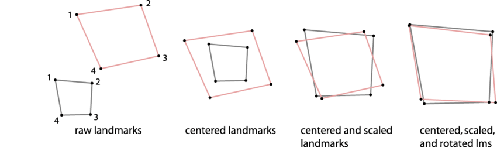
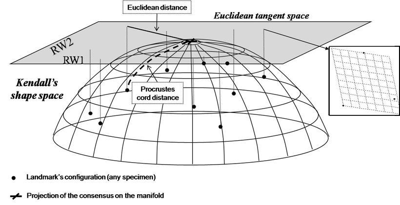

```{r setup, include=FALSE}
library(geomorph)
library(tidyverse)
knitr::opts_chunk$set(
  echo = TRUE,
  message = FALSE,
  warning = FALSE
)
set.seed(1)
```

# Geometric Morphometrics (GM)

.pull-left[
A coordinate-based approach to quantify **shape** while preserving geometry.

**Today:**
- Landmarks & semilandmarks; sliding
- GPA, centroid size, tangent space
- Deformation visualization (TPS grids, vectors)
- The `geomorph` ecosystem* (what to use, when)

*`geomorph` context throughout
]

.pull-right[


]
---

# Today's goals

.pull-left[
By the end, you should be able to:

1. Explain the difference between **landmarks** and **semilandmarks**
2. Describe what **GPA** does (and what it removes)
3. Define **centroid size** and **shape**
4. Explain **tangent space** (at an intuitive level)
5. Interpret deformation plots (TPS grids & vectors)
6. Know the core pieces of the **`geomorph`** workflow
]

.pull-right[


]
---

# What is "shape" in GM?

.pull-left[
We start with landmark coordinates:

- Each specimen has *p* points in *k* dimensions
- Stored as an array: **p × k × n** in `geomorph`

GM defines **shape** as what's left after removing:

- translation (position)
- rotation (orientation)
- scale (size)
]

.pull-right[
```{r,echo=F}
data(plethodon, package = "geomorph")

# Landmark array
Y <- plethodon$land   # p x k x n

head(Y)

```

]


---

# Landmarks

.pull-left[
A **landmark** is a homologous point you can place consistently:

- same biological feature across specimens
- e.g., joint, suture intersection, fin insertion

**Key idea:** landmarks are tied to anatomy.
]

.pull-right[

]
---

# Landmark types (bookkeeping)

.pull-left[
- **Type I:** clear intersection (high homology; best)
- **Type II:** maxima/minima of curvature (moderate)
- **Type III:** extremal points / endpoints (lowest)
]

.pull-right[

]
---

# Semilandmarks

.pull-left[
Sometimes the "feature" is a *curve or outline*:

- jaw margin
- fin edge
- skull profile

We place **semilandmarks** along the curve.
]

.pull-right[


Problem: their spacing is often arbitrary.

Solution: **sliding** semilandmarks to reduce nuisance variation.
]


---

# Sliding semilandmarks (intuition)

.pull-left[
If points lie on a curve, we want them to match *the curve*, not the arbitrary spacing.

Sliding adjusts semilandmark positions **along the curve** to optimize a criterion:

- minimize bending energy (common)
- or minimize Procrustes distance

Landmarks (fixed) stay fixed; semilandmarks can move along tangents.
]

.pull-right[


]
---

# A tiny toy example (built-in data)

*Plethodon* example dataset from `geomorph`.

```{r}
data(plethodon, package = "geomorph")

# Landmark array
Y <- plethodon$land   # p x k x n
dim(Y)
```

---

# Quick look at a few specimens

.pull-left[
```{r}
plot(Y[,,1], asp = 1, pch = 19, main = "Landmarks: specimen 1")
text(Y[,,1], labels = 1:dim(Y)[1], pos = 3, cex = 0.7)
```
]

.pull-right[


*Notice anything about the projection?*
]
---

# Generalized Procrustes Analysis (GPA)

.pull-left[
GPA aligns specimens by:

1. translating each configuration to its centroid
2. scaling each configuration to unit centroid size
3. rotating to minimize summed squared distances among corresponding landmarks

Output:
- aligned shapes
- centroid sizes
- Procrustes distances
]

.pull-right[


]

---

# Why GPA matters

.pull-left[
After GPA, differences among specimens reflect:

- relative positions of landmarks
- (i.e., **shape**)

Not:
- where the specimen sits in the image
- how it’s rotated
- how big it is
]


.pull-right[


]

---

# geomorph GPA

.pull-left[
```{r,fig.width=4}
gpa <- gpagen(Y, print.progress = FALSE)
names(gpa) 
```
]

.pull-right[
```{r}
plot(gpa)
```
]
---

# Centroid size

.pull-left[
Centroid size is a standard GM size metric:


$CS = \sqrt{ \sum_{i=1}^{p} \left\| \mathbf{x}_i - \bar{\mathbf{x}} \right\|^2 }$


p = number of landmarks

$\mathbf{x}_i$ = coordinate vector of landmark 

$\bar{\mathbf{x}}$ = centroid of all landmarks
 
In `geomorph`:

```{r}
head(gpa$Csize)
```
]

.pull-right[

```{r,echo=F}
hist(gpa$Csize)
```
]
---

# Tangent space 

.pull-left[
Shape space is curved.

We often analyze shapes using standard multivariate tools (PCA, regression), which assume Euclidean geometry.

**Tangent space** is a local, linear approximation:

- project shapes to a plane that is "tangent" at the mean shape
- works well when shapes are not extremely different
]

.pull-right[

]
---

# Check tangent space approximation

.pull-left[
`geomorph` provides implementations with PCA function:
]

.pull-right[
```{r}
pca <- gm.prcomp(gpa$coords)
plot(pca)
```
]

---

# Shape variation with PCA plot (scores)

.pull-left[
More later in Week 5
]

.pull-right[
```{r}
plot(pca, pch = 19, main = "Shape PCA (Procrustes coordinates)")
```
]
---

# Interpreting PCA in GM

.pull-left[
PC axes = directions of maximal shape variation.

To understand a PC:
- visualize deformation from mean to +/- along that axis

Two common visualizations:
- **TPS grids**
- **vector displacement plots**
]

.pull-right[

```{r,echo=F}
plot(pca, pch = 19, main = "Shape PCA (Procrustes coordinates)")
```

]
---

# Deformation visualization

.pull-left[
## Thin-Plate Spline (TPS)

TPS summarizes deformation as if the shape were a thin sheet:

- smooth warping
- emphasizes localized vs global changes

We often show:
- mean shape vs target shape
- deformation grid
]

.pull-right[

]
---

# TPS example (mean to PC1 extremes)

.pull-left[
```{r,eval=F}
ref <- mshape(gpa$coords)

# geomorph stores PC extreme shapes 
target_minus <- pca$shapes$shapes.comp1$min
target_plus  <- pca$shapes$shapes.comp1$max

par(mfrow = c(1,2))
plotRefToTarget(M1 = ref, 
                M2 = target_minus, 
                mag = 2, main = "PC1: -")
plotRefToTarget(ref, 
                target_plus,
                mag = 2, 
                main = "PC1: +")
par(mfrow = c(1,1))
```
]

.pull-right[
```{r,eval=T,echo=F}
ref <- mshape(gpa$coords)

# geomorph stores PC extreme shapes 
target_minus <- pca$shapes$shapes.comp1$min
target_plus  <- pca$shapes$shapes.comp1$max

par(mfrow = c(1,2))
plotRefToTarget(M1 = ref, 
                M2 = target_minus, 
                mag = 2, main = "PC1: -")
plotRefToTarget(ref, 
                target_plus,
                mag = 2, 
                main = "PC1: +")
par(mfrow = c(1,1))
```
]

---

# Vector displacement plots
.pull-left[
Vectors show landmark movement from reference to target:

- arrow direction = where the landmark moves
- arrow length = how much it moves

```{r,eval=F,echo=F}
par(mfrow = c(1,2))
plotRefToTarget(ref, target_minus, method = "vector", mag = 2, main = "PC1: - (vectors)")
plotRefToTarget(ref, target_plus,  method = "vector", mag = 2, main = "PC1: + (vectors)")
par(mfrow = c(1,1))
```
]

.pull-right[
```{r,echo=F}
par(mfrow = c(1,2))
plotRefToTarget(ref, target_minus, method = "vector", mag = 2, main = "PC1: - (vectors)")
plotRefToTarget(ref, target_plus,  method = "vector", mag = 2, main = "PC1: + (vectors)")
par(mfrow = c(1,1))
```
]
---

# Sliding semilandmarks in geomorph

If you have curves, you provide:
- a matrix describing curve point sequences
- optional surface constraints (3D)

Core functions:
- `gpagen(..., curves = <curves>)`
- `define.sliders()` to specify curves

---

# Semilandmark workflow

`curves` = a matrix describing semilandmark curves (sliders) and their path and endpoints

.pull-left[

```{r,eval=F}
curves <- define.sliders(cbind(c(1,2,4,5,3)),#jaw 
                         cbind(c(9,7,6,10,11,2))#skull
                         )

gpa_slid <- gpagen(Y, 
                   curves = curves, 
                   ProcD = TRUE
                  )

plot(gpa_slid)
```


Interpretation: semilandmarks slide along curves during GPA to improve correspondence.
]

.pull-right[

```{r,echo=F}
# Y = p x k x n array of landmarks + semilandmarks

curves <- define.sliders(cbind(1:6), 
                         cbind(6:12))

gpa_slid <- gpagen(Y, 
                   curves = curves, 
                   ProcD = TRUE,verbose = F,
                   print.progress = F)

plot(gpa_slid)
```
]
---

# Common pitfalls 

1. Mixing anatomical landmarks with pseudo-landmarks without justification
2. Too many semilandmarks with too few specimens (overfitting)
3. Ignoring digitizing error (repeatability)
4. Treating PCA as the analysis (it is exploratory, not a hypothesis test)
5. Over-interpreting tiny deformations (check magnitude!)

---

# The geomorph ecosystem

What geomorph gives you:

.pull-left[

**For now**

## Data + preprocessing
- `gpagen()` (GPA + optional sliding)
- `plotAllSpecimens()`, `plotOutliers()`

## Exploration
- `gm.prcomp()` (PCA)

]

.pull-right[

**Later on**

## Hypothesis tests (shape)
- `procD.lm()` (Procrustes ANOVA/regression)
- `pairwise()` (posthoc)

## Integration / modularity
- `two.b.pls()` (PLS)
- `integration.test()`, `modularity.test()`

## Phylogenetic Comparative Methods
- `phylo.procD.lm()`
- `physignal()` (phylogenetic signal)
]

---

# Adding size (allometry)

.pull-left[
Classic question:

Does shape change with size?

```{r,eval=F}
fit_allom <- procD.lm(gpa$coords ~ log(gpa$Csize), iter = 999)
summary(fit_allom)$table[,6:7]
```
]

.pull-right[
```{r,echo=F}

fit_allom <- procD.lm(gpa$coords ~ log(gpa$Csize), iter = 999)
summary(fit_allom)$table[,6:7]
```
]

---

# Visualizing allometry

standardized shape scores from the regression of shape on size

.pull-left[
```{r,eval=F}
plotAllometry(fit_allom, 
              size = log10(gpa$Csize), 
              method = "RegScore",
              logsz = T)

```
]

.pull-right[

```{r,echo=F}
plotAllometry(fit_allom, 
              size = log10(gpa$Csize), 
              method = "RegScore",
              logsz = T)

```
]

---
# This week's AME

For AME 3:
- digitizing landmarks (imageJ/FIJI tutorial Thursday)
- deciding which points are landmarks vs semilandmarks
- running GPA and checking tangent space
- visualizing deformations
