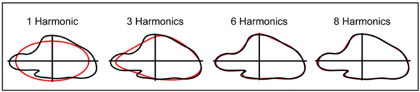
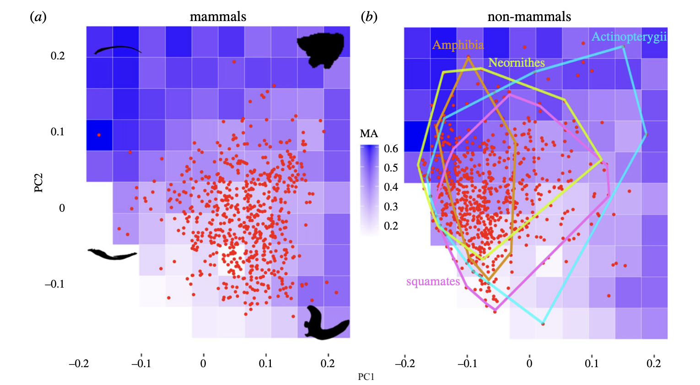
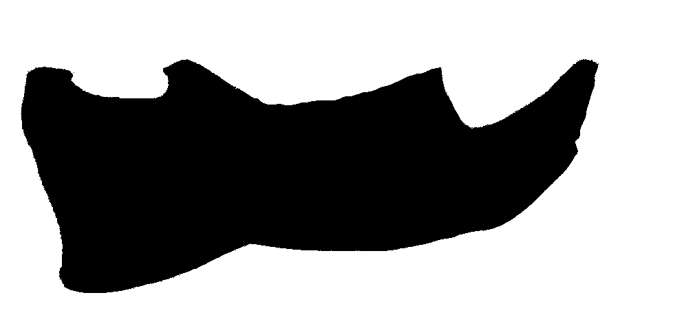
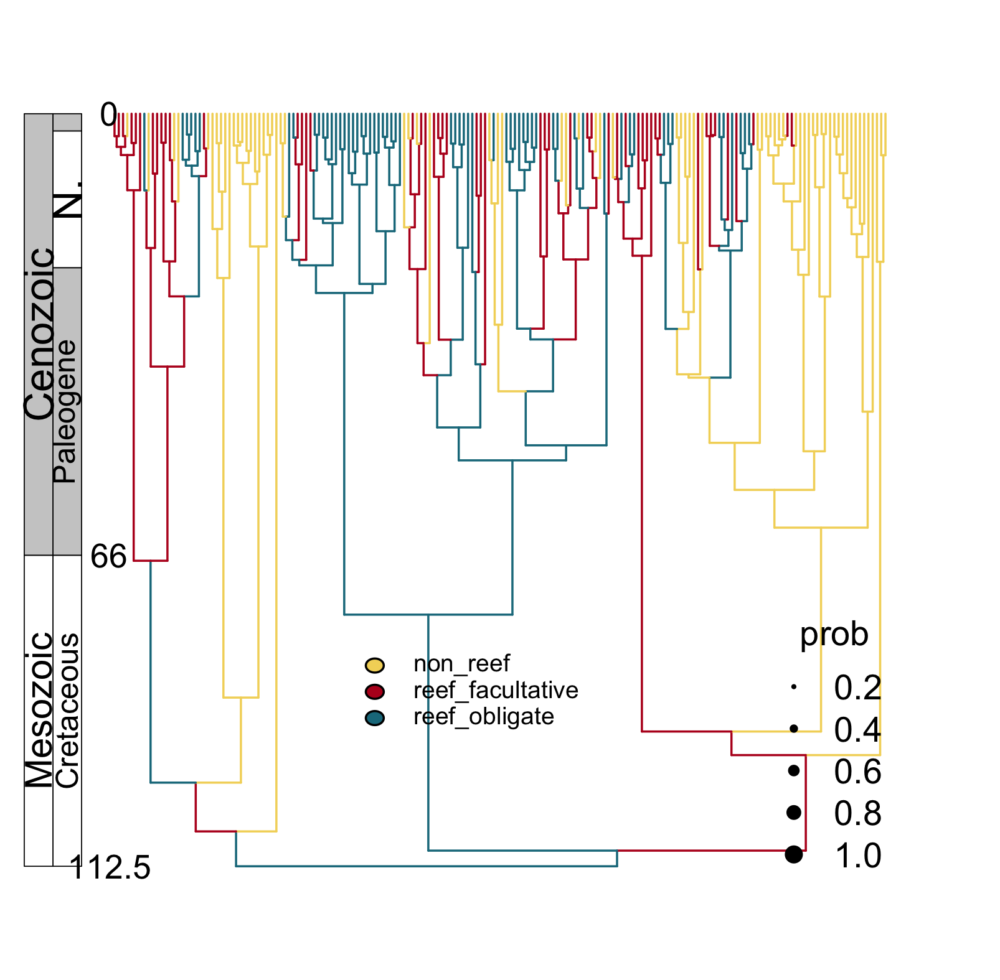
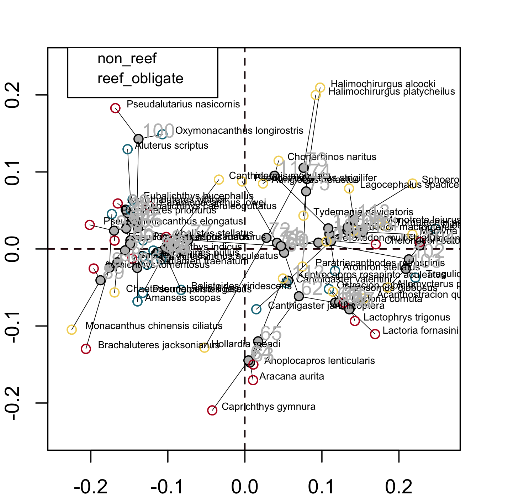

# Today

+ Outline analysis based on Fourier descriptors
+ Worflow with `Momocs`
+ Update on puffer project


---
```{r setup, include=FALSE}
library(tidyverse)
library(Momocs)
knitr::opts_chunk$set(echo = TRUE, message = FALSE, warning = FALSE)
```

# Problem

.pull-left[
Landmarks work when:
  - homologous points exist
  - anatomy is discrete

They fail when:
  - shapes are smooth
  - boundaries continuous
  - homology unclear

Examples:
- teeth
- fins
- leaves
- shells
- jaws
]

.pull-right[


]

---
  
# Solution: outlines

.pull-left[  
Use the whole boundary instead of points

Represent shape as many equally spaced coordinates
]

.pull-right[


]

---
  
# Elliptic Fourier Descriptors (EFDs)

.pull-left[
Idea:
A complex outline = sum of simple waves

Low harmonics: coarse shape  
High harmonics: fine detail
]

.pull-right[

]
---
# Light math intuition

## Step 1 — Trace the outline

.pull-left[
We walk around the boundary:

- record $x(t)$, $y(t)$
- $t$ = position along the outline
- start anywhere, go all the way around

So the shape becomes:
  
  $x(t)$ and $y(t)$ are periodic

Each approximated as:

$x(t) = a_n cos(nt) + b_n sin(nt)$
$y(t) = c_n cos(nt) + d_n sin(nt)$
  
]

.pull-right[


]

---
# Step 2 — Fourier Transform

.pull-left[

Each approximated as:

$x(t) = a_n cos(nt) + b_n sin(nt)$
$y(t) = c_n cos(nt) + d_n sin(nt)$
  
Each harmonic adds 4 coefficients:

- $a_n$
- $b_n$
- $c_n$
- $d_n$

These are the **Elliptic Fourier Descriptors**

i.e., numbers that store the shape
]

.pull-right[


]
---

# Step 2 — Fourier Transform

.pull-left[
A Fourier series says:

x(t) = sum of waves $\sum a_n cos(nt) + b_n sin(nt)$ 

y(t) = sum of waves $\sum c_n cos(nt) + d_n sin(nt)$  

Each wave = a **harmonic**

Each harmonic:

- is basically a rotating vector
- traces an **ellipse**
- adding ellipses together builds the outline


]

.pull-right[


So:

+ Harmonic 1 → big oval  
+ Harmonic 2 → more detail  
+ Harmonic 3 → finer detail 
]

---

# What do harmonics do?

.pull-left[
| Harmonic | Captures |
|----------|-------------------------|
| 1 | overall size/orientation |
| 2–5 | major body shape |
| 6–10 | fins/lobes |
| high n | tiny wiggles/noise |

Rule of thumb:
- few harmonics = smooth blob
- many harmonics = detailed outline
]

.pull-right[


]


---
# Workflow

.pull-left[
1 import outlines  
2 compute EFDs  
3 coefficients become variables  
4 PCA or regression  
5 reconstruct shapes to interpret
]

.pull-right[


]
---
  
# Example with Momocs

.pull-left[
```{r}
library(Momocs)
panel(apodemus) #loaded with Momocs
```
]

.pull-right[


]
---
  
# Compute EFDs (coefficients) 
  
With your own outlines, would need to align first

More harmonics = better fit

```{r}
ef <- efourier(apodemus, nb.h = 10)
```

---
  
# PCA on Coefficients and Reconstruction
  
  Same logic as landmark PCA


```{r,fig.width=6,fig.height=4,fig.align='center'}
ef %>% 
  PCA %>% 
  plot
```


---
  
# Biological examples

.pull-left[
Teeth: serration and cusp shape  
Fins: smooth margins  
Leaves: lobes vs entire  
Shells: curved outlines  
Jaws: functional silhouettes
]

.pull-right[


]

---
# When to use landmarks vs outlines
  
Landmarks:
  - bones
  - joints
  - internal structure

Outlines:
  - smooth silhouettes
  - few homologies
  - external form important

---
#Pros and Concs
.pull-left[
## Advantages
  
- no homology needed
- captures entire boundary
- scalable/"automatable"
- easy stats
- reconstructable
]

.pull-right[
## Limitations
  
- boundary only
- less anatomical interpretability
- sensitive to segmentation/digitization noise
- few (if any?) comparative method
]

---
# Puffer update

.pull-left[
## What questions are we asking?

+ Shape evolves unevenly because?
+ Tempo of shape evolves unevenly?

**non-reef**<br>


]

.pull-right[


**reef facultative**<br>


**reef obligate**<br>


]


---
# Puffer update

.pull-left[
## What questions are we asking?

+ Shape evolves unevenly because?
+ Tempo of shape evolves unevenly?

Simmap analysis (later)


]

.pull-right[



]

---
# Puffer update

.pull-left[
## What questions are we asking?

+ Shape evolves unevenly because?
+ Tempo of shape evolves unevenly?

Phylomorphospace (later)

]

.pull-right[



]