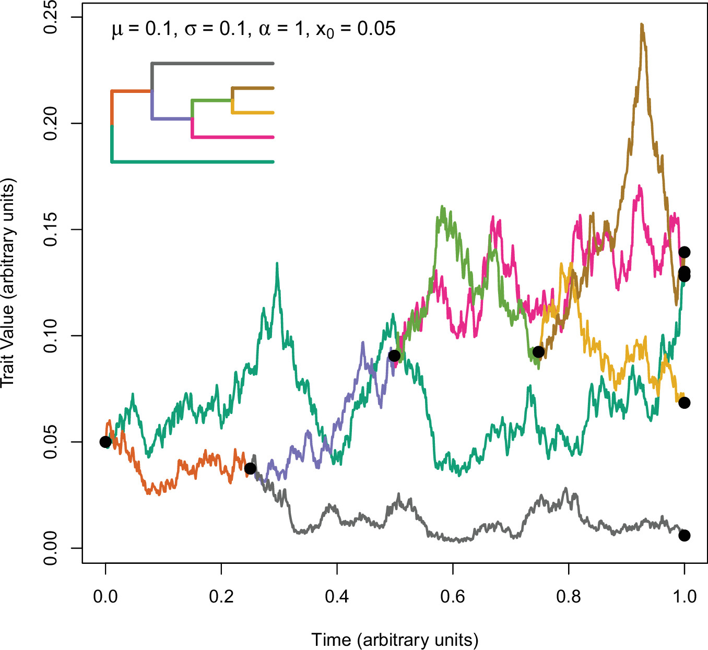
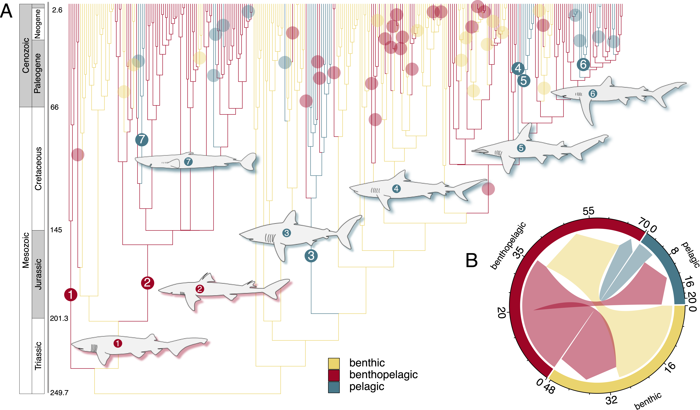

```{r setup, include=FALSE}
knitr::opts_chunk$set(echo = TRUE, warning = FALSE, message = FALSE)
```

# Models of Evolution
## Tempo and Mode

---

# What do we mean by Tempo and Mode?

.pull-left[
**Tempo**  
- The *rate* of evolutionary change  
- Fast vs slow evolution  
- Constant vs variable rates across a phylogeny  

**Mode**  
- The *pattern or process* of evolution  
- Examples:
  - Brownian Motion (random walk)
  - Ornstein–Uhlenbeck (adaptive peaks)
  - Early burst models
]  
  .pull-right[

]
---

# Brownian Motion (BM)
.pull-left[
- Trait variance accumulates through time
- No preferred direction
- Often used as a null model

Key idea:
> The expected difference between species increases with time since divergence.
]

.pull-right[


Simulations over three different times: (A) 10, (B) 50, and (C) 100 time units.
]
---

# Ornstein–Uhlenbeck (OU).

.pull-left[
- Evolution toward an adaptive optimum ($\sigma^2$)
- Strength of pull determined by ($\alpha$), the rubberband parameter
- Useful for testing adaptive hypotheses

Examples in morphology:
- Body shape adapting to habitat
- Functional constraints
]

.pull-right[

]
---

# Visualizing Evolution on Trees

.pull-left[
Why visualize traits on trees?
- Detect convergence
- Identify clades with rapid change
- Explore adaptive shifts

Common tools in R:
- phytools
- geiger
- ape
]

.pull-right[

]
---

# Example: Plotting a Trait on a Tree

.pull-left[
```{r,eval=F}
library(ape)
library(phytools)

tree <- rtree(30)
trait <- setNames(rnorm(30),tree$tip.label)

contMap(tree, trait)
```
]

.pull-right[

```{r,echo=F}
library(ape)
library(phytools)

tree <- rtree(30)
trait <- setNames(rnorm(30),tree$tip.label)

contMap(tree, trait)
```
]
---

# Tree-Linked Visualization

Goals:
- Map traits onto branches
- See where changes occur
- Identify evolutionary patterns

Methods:
- Continuous trait mapping
- Discrete trait mapping
- Stochastic character mapping

---

# Ancestral State Reconstruction

Question:
> What were the traits of ancestral species?

Approaches:
- Maximum likelihood
- Bayesian inference
- Stochastic mapping (simmap)

---

# Stochastic Character Mapping (simmap)

.pull-left[
What it does:
- Simulates histories of trait change
- Provides distributions of transitions
- Allows uncertainty in ancestral states
]

.pull-right[


]
---

## The Key Idea

.pull-left[
We usually know:
- The tree
- The trait at the tips
- A model of transition rates (Q matrix)

We *do not* know:
- Exactly where changes occurred
- How many times transitions happened

simmap solves this by **simulating many possible histories**.
]

.pull-right[


]
---

## Think of it Like This

1. Start with the observed states at the tips  
2. Use the evolutionary model to simulate changes along branches (what are the chances?)
3. Repeat this many times  
4. Summarize the results

> Each simulation is one plausible evolutionary history.

---

## What Do We Get?

From many simulations we can estimate:
- Probability of ancestral states
- Number of transitions
- Direction of transitions
- Time spent in each state

---

## Why This Matters in Shape Evolution

.pull-left[
We can ask:
- Did body shapes evolve after habitat shifts?
- Are some habitats evolutionary “sinks” or “sources”?
- Do transitions cluster in certain clades?
]

.pull-right[



]
---

# Example simmap Workflow in R

.pull-left[
```{r,eval=F}
library(phytools)

tree <- rtree(20)
states <- sample(
  c("reef","pelagic","benthic"), 
  20, 
  replace=TRUE)
names(states) <- tree$tip.label

simmap <- make.simmap(
  tree, 
  states,
  model="ER", 
  nsim=10)

plotSimmap(simmap[[1]])
```
]

.pull-right[
```{r,echo=F}
library(phytools)

tree <- rtree(20)
states <- sample(c("reef","pelagic","benthic"), 20, replace=TRUE)
names(states) <- tree$tip.label

simmap <- make.simmap(tree, states, model="ARD", nsim=10)
```

]

---

# Example simmap Workflow in R

.pull-left[
```{r,eval=F}
plotSimmap(simmap[[1]])
```
]

.pull-right[
```{r,echo=F}
plotSimmap(simmap[[1]])
```

]

---
# Models of Discrete Character Evolution

`make.simmap(tree, states, model="ARD", nsim=10)`

When reconstructing ancestral states or running simmap,  
we must choose a **model of how transitions occur**.

These models differ in how they treat **transition rates between states**.

---
# Models of Discrete Character Evolution

## ER — Equal Rates

**Assumption:**  
All transitions occur at the same rate.

Example (3 habitats):
- Reef → Pelagic = same rate  
- Pelagic → Benthic = same rate  
- Benthic → Reef = same rate  

**Interpretation:**  
No direction or bias in transitions.

**Use when:**  
- You want a simple baseline model  
- Data are limited

---
# Models of Discrete Character Evolution

## SYM — Symmetrical Rates

**Assumption:**  
Forward and reverse transitions are equal,  
but different pairs of states can differ.

Example:
- Reef ↔ Pelagic has one rate  
- Reef ↔ Benthic has another rate  

But:
- Reef → Pelagic = Pelagic → Reef

**Interpretation:**  
Transitions differ among habitat pairs,  
but there is no directional bias.

---
# Models of Discrete Character Evolution

## ARD — All Rates Different

**Assumption:**  
Every transition has its own rate.

Example:
- Reef → Pelagic ≠ Pelagic → Reef  
- Pelagic → Benthic ≠ Benthic → Pelagic  

**Interpretation:**  
Allows directional evolution and asymmetry.

**Use when:**  
- You suspect evolutionary bias  
- You have enough data to estimate many parameters

---

## Choosing Among Models

Typically:
1. Fit ER, SYM, and ARD  
2. Compare AIC or likelihood  
3. Use the best-supported model for simmap

---

# Interpreting simmap Results

.pull-left[
You can estimate:
- Number of transitions
- Directionality of changes
- Time spent in each state

Example:

```{r,eval=F}
describe.simmap(simmap)
```
]

.pull-right[
```{r,echo=F}
describe.simmap(simmap)
```

]
---

# Biological Questions You Can Ask

- Does habitat influence body shape evolution?
- Are transitions between habitats rare or common?
- Do some clades evolve faster than others?

---

# Summary

Key ideas:
- Tempo = rate of evolution
- Mode = process of evolution
- Trees allow visualization of evolutionary patterns
- simmap helps reconstruct probable histories


